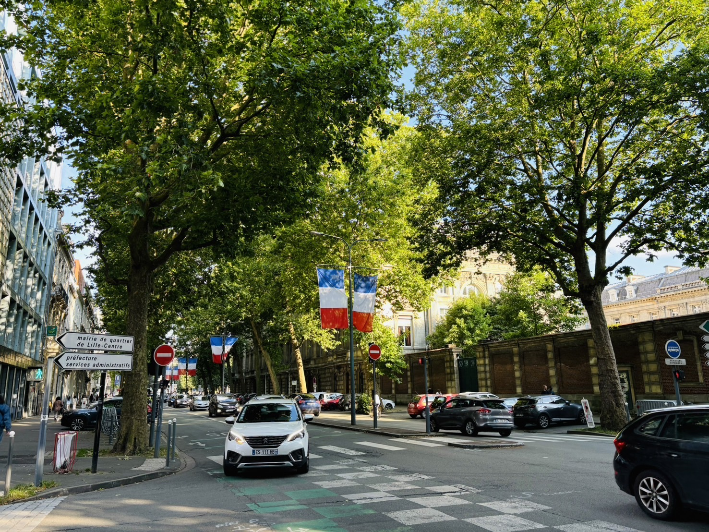
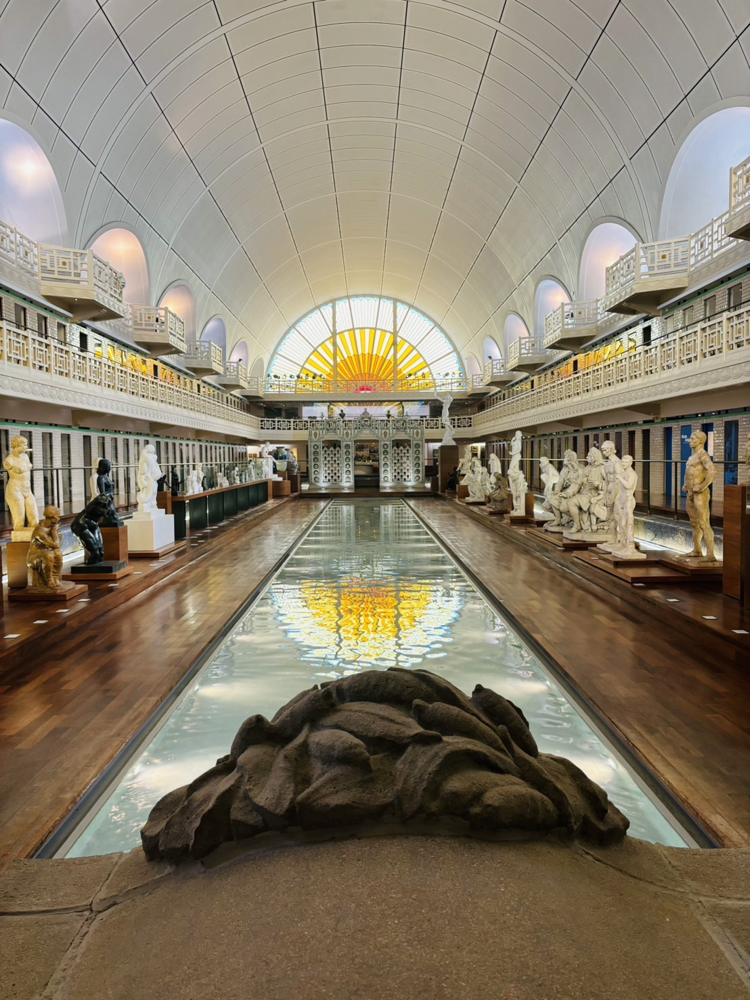

The 36th Euromicro Conference on Real-Time Systems (ECRTS 2024) is over. As a publicity chair, I was involved very early in the organization to call for workshops and papers -- "Apologies if you receive multiple copies of this message". I hope this is the last time :D

This year we have a very nice program: 17 accepted papers out of 62 submissions (acceptance rate 27%), forming 6 technical sessions over the following 4 days. Prior to that, we have a workshop day, where I also chair [the 18th OSPERT](https://khchen.eu/post/co-chair-of-ospert-2024/). 

The venue is also very lovely and lively. I like the vibe of Lille so much and enjoyed the time there.

In the social event, we had a nice tour in Musée d’art et d’industrie – La Piscine, which is the only museum in France with running water inside.

For more information about ECRTS 2024 and the papers featured in its program, please refer to [the ECRTS 2024 website](https://www.ecrts.org/). Next year we will see each other in Brussels, Belgium!